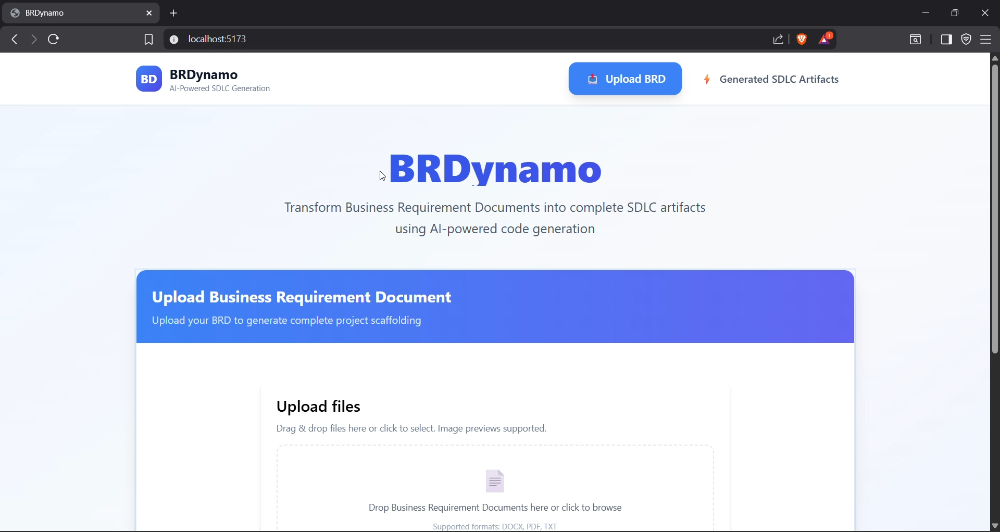
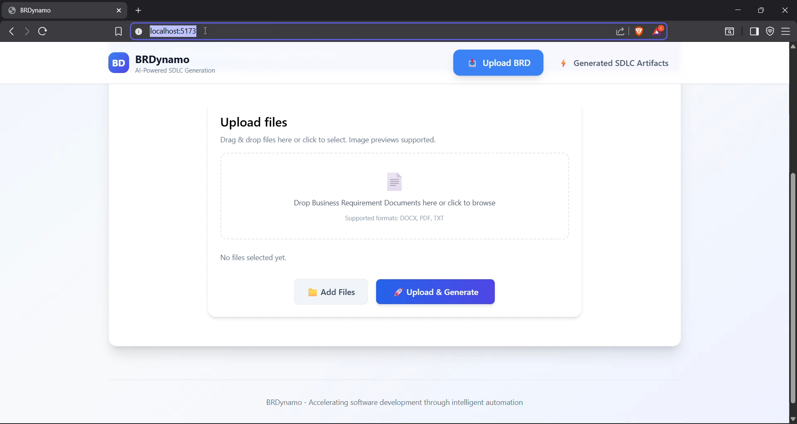

# BRDynamo

BRDynamo — Revolutionizing Software Development with Generative AI

BRDynamo is a cutting-edge full-stack prototype designed to transform the way software development is approached. By leveraging the power of generative AI, BRDynamo simplifies the process of converting Business Requirements Documents (BRDs) into fully functional source code, complete JIRA stories, and project management artifacts. This tool empowers developers to focus on innovation while automating repetitive development lifecycle tasks.

## ✨ Key Features

### 🚀 **Core Functionality**
- **Seamless BRD Upload**: Upload text, PDF, or DOCX files with drag-and-drop support and file validation
- **Generative AI Parsing**: Automatically parse BRDs into structured JSON using advanced Google Gemini AI models
- **Smart Code Generation**: Generate complete project scaffolding with intelligent naming and proper folder structure
- **Interactive File Explorer**: Modern tree-view navigation with syntax highlighting and responsive design

### 📊 **Project Management Integration**
- **JIRA Story Generation**: Create actionable, project-specific JIRA stories based on actual BRD requirements
- **Epic Organization**: Structured epics for Development, Testing, DevOps, and Documentation
- **Story Point Estimation**: Automatic story point calculation and sprint planning recommendations
- **CSV Export**: Download JIRA stories as CSV for easy import into project management tools

### 🎨 **Enhanced User Experience**
- **Modern UI/UX**: Clean, professional interface with Tailwind CSS and Framer Motion animations
- **Smart File Re-upload**: Fixed file selection issues - upload, remove, and re-upload the same file seamlessly
- **Intelligent Project Naming**: Generate clean, meaningful project names avoiding common stop words
- **Auto-Tab Selection**: Automatic tab selection in JIRA stories view for better user flow
- **Responsive Design**: Optimized for desktop and mobile viewing

### 🛠 **Technical Excellence**
- **Downloadable Output**: Download generated code as ZIP file for easy integration
- **Architecture Diagrams**: Auto-generated system architecture, database ER, and API flow diagrams using [Kroki.io](https://kroki.io/)
- **Swagger API Integration**: Comprehensive API documentation for seamless backend interaction
- **Error Handling**: Robust error handling and user feedback throughout the application
- **File Type Validation**: Smart file type detection supporting DOCX, PDF, and TXT formats

---

### Collaborators

We extend our heartfelt gratitude to the following contributors for their invaluable efforts in building BRDynamo:

- [@pallavi-buwa](https://github.com/pallavi-buwa)
- [@sandeepchandrapati](https://github.com/sandeepchandrapati)
- [@subhajitghosh88](https://github.com/subhajitghosh88)
- [@akhileshmorishetty](https://github.com/akhileshmorishetty)
- [@manojamachavarapudev](https://github.com/manojamachavarapudev)
- [@sgallenki](https://github.com/sgallenki)

---

This comprehensive full-stack application transforms Business Requirements Documents (BRDs) into complete development ecosystems. BRDynamo not only generates source code but also creates actionable JIRA stories, project management artifacts, and provides a professional development experience from requirements to deployment-ready code.

## 📁 Project Structure

- `backend/` — **Enhanced Flask Application**
  - BRD processing with multi-format support (TXT, PDF, DOCX)
  - Google Gemini AI integration for intelligent parsing
  - Smart code generation with meaningful project naming
  - JIRA story generation engine with epic organization
  - RESTful API with comprehensive Swagger documentation

- `frontend/` — **Modern React + Vite Application**
  - Professional UI with Tailwind CSS and Framer Motion animations
  - Advanced file uploader with drag-and-drop and validation
  - Enhanced file explorer with smart sorting and navigation
  - Multi-view JIRA stories interface with CSV export
  - Responsive design optimized for all devices

- `brd-examples/` — **Sample Business Requirement Documents**
  - Real-world BRD examples for testing and demonstration
  - Various project types: e-commerce, library management, task management

## 🔧 Technical Implementation

### Backend Features
- **Multi-format BRD Processing**: Support for text, PDF, and DOCX file uploads with intelligent parsing
- **Advanced AI Integration**: Google Gemini API integration for sophisticated BRD analysis and code generation
- **Smart Project Structure**: Intelligent project naming algorithm that creates meaningful, clean names
- **JIRA Story Engine**: Generate comprehensive, project-specific JIRA stories with proper epic organization
- **RESTful API Design**: Well-documented endpoints with Swagger integration

### API Endpoints
- `POST /upload` — Upload BRD and trigger comprehensive parsing + code generation
- `GET /generated-files` — Retrieve generated files with flat path mapping
- `GET /generated-code/status` — Check if ZIP package is ready for download
- `GET /generated-code` — Download complete generated code as ZIP file
- `GET /jira-stories` — Retrieve generated JIRA stories and project management artifacts

### Frontend Architecture
- **Modern React + Vite**: Fast, responsive single-page application with hot module replacement
- **Professional File Uploader**: 
  - Intuitive drag-and-drop interface with real-time visual feedback
  - Intelligent file type validation and restriction (DOCX, PDF, TXT only)
  - Seamless re-upload functionality with advanced state management
  - Real-time progress tracking and comprehensive status indicators
- **Advanced File Explorer**: 
  - Custom dependency-free tree component with nested folder support
  - Intelligent folder-first sorting with src directories prioritized
  - Horizontal scrolling optimization for long file names
  - Clean single scrollbar architecture for optimal viewing experience
  - Rich file type icons and comprehensive syntax highlighting
- **Professional Code Viewer**: 
  - Side-by-side file exploration and content viewing
  - Syntax highlighting using highlight.js (CDN)
  - Code fence stripping for clean model output display
- **Professional JIRA Stories Interface**:
  - Multi-format view supporting Markdown and CSV display
  - Intelligent auto-selection for optimal user workflow
  - Integrated download functionality for seamless project management tool integration
  - Modern card-based design with enterprise-grade professional styling

## � Advanced Features & Capabilities

### **Professional User Interface**
- 🎯 **Enterprise-Grade Design**: Modern, professional interface built with Tailwind CSS and Framer Motion animations
- 🗂️ **Intelligent File Explorer**: Smart folder-first sorting with horizontal scrolling and single scrollbar architecture
- 📊 **Professional JIRA Stories View**: Card-based layout with enhanced tables and CSV download functionality
- 🔄 **Seamless File Management**: Robust file re-upload capability with proper input state management

### **Smart Project Generation**
- 🏷️ **Intelligent Naming**: Clean, meaningful project names using advanced filtering algorithms to avoid technical jargon
- 📁 **Optimized Structure**: Proper folder organization with src directories prioritized in navigation
- ✨ **Auto-Navigation**: Automatic tab selection and intuitive user flow throughout the application
- 🎛️ **Professional Controls**: Enhanced UI controls with visual feedback and status indicators

### **Comprehensive JIRA Integration**
- 📋 **Project-Specific Stories**: Actionable user stories generated from actual BRD content, not generic templates
- 🏗️ **Epic Organization**: Structured stories across Development, Testing, DevOps, and Documentation epics
- 📊 **Smart Estimation**: Automatic story point calculation and sprint planning recommendations
- 💾 **Multi-Format Export**: CSV export for seamless integration with existing project management tools

### **Enterprise-Quality Engineering**
- 🔒 **Robust Validation**: Comprehensive file type validation supporting DOCX, PDF, and TXT formats
- ⚡ **Performance Optimized**: Fast loading times with efficient state management and error handling
- 🛡️ **Error Resilience**: Comprehensive error handling with graceful degradation and user feedback
- 🏗️ **Clean Architecture**: Modular component design with clear separation of concerns

## How to run (local)

### Prerequisites

Before running the backend, you'll need to set up your environment variables:

1. **Create a `.env` file** in the `backend/` directory
2. **Get your Gemini API Key** from [Google AI Studio](https://aistudio.google.com/api-keys)
3. **Add the API key** to your `.env` file:

```env
GEMINI_API_KEY=your_gemini_api_key_here
```

> **Note**: The `.env` file is not checked into git for security reasons. Make sure to keep your API key confidential and never commit it to version control.

### Backend Setup

Backend (PowerShell example):

```powershell
cd C:\path\to\brdynamo\backend
python -m venv .venv
.\.venv\Scripts\Activate
python -m pip install --upgrade pip
pip install -r requirements.txt
python main.py    # or use flask run depending on main.py
```

Frontend:

```powershell
cd C:\path\to\brdynamo\frontend
npm install
npm run dev
```

Open the frontend address shown by Vite (usually http://localhost:5173) and the backend if required at http://localhost:8000 (or the port in your backend config).

### 🔗 API Documentation

BRDynamo includes comprehensive API documentation through Swagger UI:

- **Swagger UI Interface**: Access at `http://localhost:8000/` when the backend is running
- **Interactive API Testing**: Test all endpoints directly through the Swagger interface
- **Complete Documentation**: Detailed parameter descriptions, response schemas, and example requests
- **Real-time Validation**: Live API validation and response testing


## 📸 Screenshots

### Application Walkthrough

Experience BRDynamo's complete workflow from BRD upload to code generation and project management.

#### 🚀 Landing Page Interface



#### 🛠️ Swagger API Documentation


### 📂 Complete Screenshot Gallery

The complete collection of **40+ detailed screenshots** showcasing every feature and workflow is available in the [`docs/screenshots/`](docs/screenshots/) directory. These include:

- **User Interface Variations**: Different views and states across all application screens
- **Feature Deep Dives**: Detailed walkthroughs of advanced functionality
- **API Documentation**: Complete Swagger UI interface and endpoint details

> 🔗 **View All Screenshots**: Browse the complete gallery at [`docs/screenshots/`](docs/screenshots/) for detailed visual documentation of every feature and workflow.

---

## Video walkthrough

The walkthrough video is available in `docs/video/BRDynamo.mp4`. It demonstrates the full flow: uploading a BRD, automatic parsing/generation, browsing generated files, and downloading the ZIP.

<video controls width="900" poster="docs/screenshots/screenshot_1.png">
	<source src="docs/video/BRDynamo.mp4" type="video/mp4">
	Your browser does not support the video tag. You can download the walkthrough directly: [docs/video/BRDynamo.mp4](docs/video/BRDynamo.mp4)
</video>

## 👨‍💻 Developer Notes

### **Code Architecture**
- **Clean Code Principles**: Modular components with clear separation of concerns
- **Performance Optimized**: Lightweight implementation without heavy external dependencies
- **Responsive Design**: Mobile-first approach with Tailwind CSS utility classes
- **Error Resilient**: Comprehensive error handling and graceful degradation

### **Key Technical Details**
- **LLM Output Processing**: Advanced parser with intelligent code fence stripping for clean, production-ready code display
- **File Management**: Automated file organization under `backend/generated_code/` with seamless ZIP packaging
- **Custom Tree Component**: Lightweight `FileExplorer` built without external dependencies for optimal performance and maintainability
- **Intelligent Naming**: Sophisticated project name generation algorithm with smart filtering and meaningful abbreviation creation
- **Advanced State Management**: Robust input handling designed for seamless file re-upload capabilities and optimal user experience

### **Browser Compatibility**
- **Modern Browsers**: Optimized for Chrome, Firefox, Safari, and Edge
- **File API Support**: Utilizes modern File API for drag-and-drop functionality
- **CSS Grid & Flexbox**: Modern layout techniques for responsive design

### **Security Considerations**
- **File Type Validation**: Client and server-side file type restrictions
- **API Key Protection**: Environment variables for sensitive configuration
- **Input Sanitization**: Secure handling of user uploads and file processing

## 🚀 What's Next

### **Planned Enhancements**
- **Multi-language Support**: Expand beyond Java Spring Boot to Python Flask, Node.js Express, .NET Core
- **Advanced AI Models**: Integration with multiple AI providers (OpenAI GPT, Anthropic Claude, Azure OpenAI)
- **Database Integration**: Support for multiple database types (PostgreSQL, MySQL, MongoDB)
- **Advanced JIRA Features**: Integration with JIRA API for direct story creation
- **Team Collaboration**: Multi-user workspaces and project sharing capabilities
- **Version Control**: Git integration and automated repository setup

### **Contributing**
We welcome contributions from the development community! Areas where you can help:
- **Frontend Enhancement**: React components, UI/UX improvements
- **Backend Optimization**: API performance, new AI model integrations
- **Documentation**: Code examples, tutorials, best practices
- **Testing**: Unit tests, integration tests, end-to-end testing
- **Bug Reports**: Issues, feature requests, improvement suggestions

### **Getting Involved**
1. **Fork the repository** and create your feature branch
2. **Follow the coding standards** and add appropriate tests
3. **Update documentation** for any new features
4. **Submit a pull request** with detailed description of changes
5. **Join the discussion** in issues and project planning

---

*BRDynamo represents the future of AI-assisted software development - where business requirements seamlessly transform into production-ready code and comprehensive project management artifacts.*

