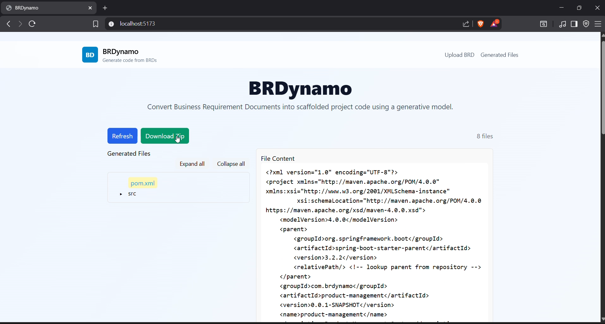
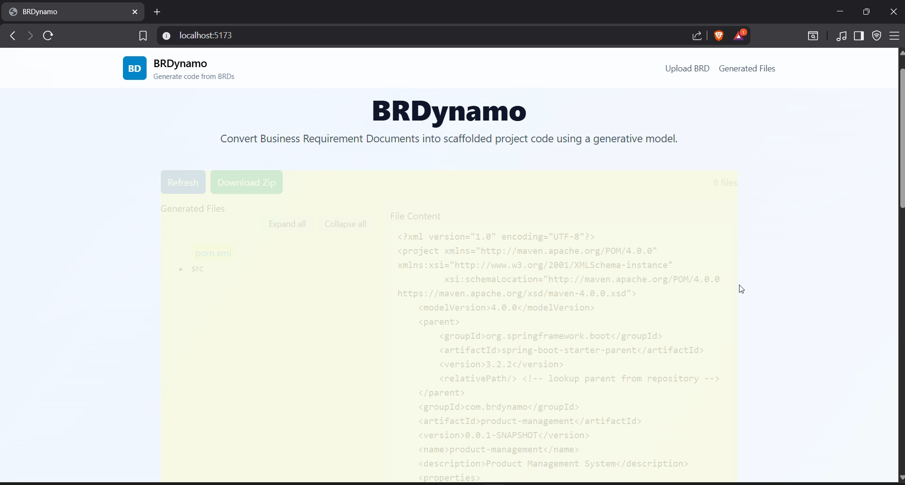
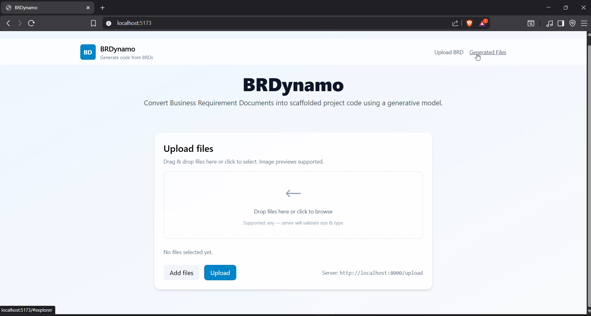

# BRDynamo

BRDynamo — Revolutionizing Software Development with Generative AI

BRDynamo is a cutting-edge full-stack prototype designed to transform the way software development is approached. By leveraging the power of generative AI, BRDynamo simplifies the process of converting Business Requirements Documents (BRDs) into fully functional source code. This tool empowers developers to focus on innovation while automating repetitive tasks.

## Key Features

- **Seamless BRD Upload**: Upload text, PDF, or DOCX files effortlessly.
- **Generative AI Parsing**: Automatically parse BRDs into structured JSON using advanced generative AI models.
- **Code Generation**: Generate project files with a clear mapping of paths and content.
- **Interactive Frontend**: Explore generated files in a lightweight, dependency-free file explorer with syntax highlighting.
- **Downloadable Output**: Download the generated code as a ZIP file for easy integration.
- **Swagger API Integration**: Access detailed API documentation for seamless backend interaction.

---

### Collaborators

We extend our heartfelt gratitude to the following contributors for their invaluable efforts in building BRDynamo:

- [@pallavi-buwa](https://github.com/pallavi-buwa)
- [@sandeepchandrapati](https://github.com/sandeepchandrapati)
- [@subhajitghosh88](https://github.com/subhajitghosh88)
- [@akhileshmorishetty](https://github.com/akhileshmorishetty)
- [@manojamachavarapudev](https://github.com/manojamachavarapudev)
- [@sgallenki](https://github.com/sgallenki)

---

This repository contains a small full-stack prototype that accepts a BRD (Business Requirements Document), parses it with a generative model, generates source code files from the parsed BRD, and displays the generated files in a lightweight frontend with syntax highlighting and a download-as-zip option.

## Contents

- `backend/` — Flask application that handles BRD uploads, parses BRDs using a generative model wrapper, generates code files (written into `backend/generated_code/`), and exposes endpoints to list and download generated files.
- `frontend/` — React + Vite frontend that lets a user upload a BRD, then view the generated files in a dependency-free file explorer and view file contents with syntax highlighting (highlight.js loaded from CDN).

## Features implemented

- Upload BRD (text/PDF/docx) to `/upload`.
- Parse BRD with a generative model helper (Gemini / Google generative API wrapper) and store parsed output as JSON.
- Generate project files (map of path -> content) and write into `backend/generated_code/`.
- Endpoints:
	- `POST /upload` — upload BRD and trigger parsing + code generation.
	- `GET /generated-files` — list generated files (flat path mapping).
	- `GET /generated-code/status` — return JSON `{ "ready": <bool> }` whether a ZIP package exists.
	- `GET /generated-code` — download the generated code as a ZIP file.
- Frontend:
	- File uploader UI for sending BRD to backend.
	- Dependency-free `FileExplorer` component that builds a nested tree from flat paths and supports collapsing/expanding folders.
	- `CodeViewer` component that shows file contents side-by-side with the explorer, strips triple-backtick code fences from model output, and applies syntax highlighting using highlight.js (CDN).
	- Download ZIP button to fetch `/generated-code`.

## How to run (local)

Backend (PowerShell example):

```powershell
cd C:\path\to\brdynamo\backend
python -m venv .venv
.\.venv\Scripts\Activate
python -m pip install --upgrade pip
pip install -r requirements.txt
python main.py    # or use flask run depending on main.py
```

Frontend:

```powershell
cd C:\path\to\brdynamo\frontend
npm install
npm run dev
```

Open the frontend address shown by Vite (usually http://localhost:5173) and the backend if required at http://localhost:8000 (or the port in your backend config).

## Screenshots

### Screenshots gallery (step-by-step)

Below is a step-by-step visual guide to the BRDynamo application. Each screenshot is grouped by functionality and includes a short caption.

#### Landing Page


#### Upload Process


#### Code Generation


#### File Explorer and Code Viewer


#### Download Flow


#### Uplaod Endpoint


#### Swagger Landing Page


#### Additional Screenshots

- 
- 
- 
- 
- 
- 
- 
- 
- 
- 
- 
- 
- 
- 
- 
- 
- 
- 
- 
- 
- 

---

## Video walkthrough

The walkthrough video is available in `docs/video/BRDynamo.mp4`. It demonstrates the full flow: uploading a BRD, automatic parsing/generation, browsing generated files, and downloading the ZIP.

<video controls width="900" poster="docs/screenshots/screenshot_1.png">
	<source src="docs/video/BRDynamo.mp4" type="video/mp4">
	Your browser does not support the video tag. You can download the walkthrough directly: [docs/video/BRDynamo.mp4](docs/video/BRDynamo.mp4)
</video>

## Developer notes

- The parser includes logic to strip triple-backtick fenced blocks (```) from LLM output so the CodeViewer shows raw source.
- Generated files are saved under `backend/generated_code/`. The generator packages them into a ZIP when requested by `/generated-code`.
- The `FileExplorer` component was implemented without external tree dependencies to keep the frontend lightweight and easy to maintain.

